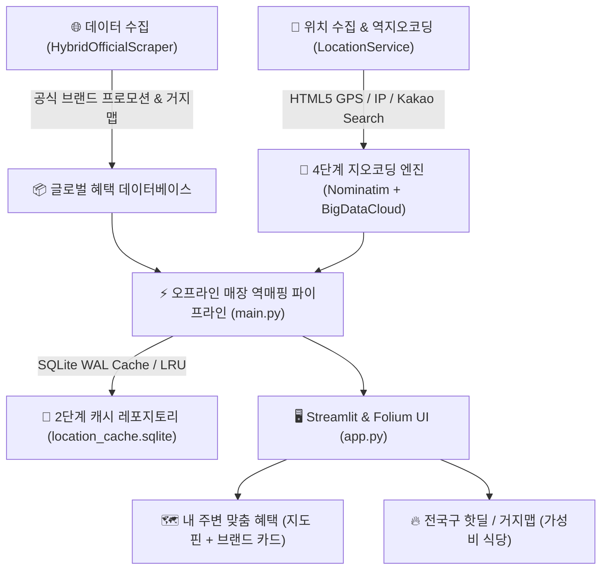

# 📍 Geo-Alert Tracker (Info Waves v2.0)

**Info Waves**는 위치 기반 프랜차이즈 혜택, 가성비 거지맵 식당, 브랜드 프로모션 정보를 실시간 수집하여 내 위치 주변으로 역매핑해주는 **Geospatial Deal & Discount Aggregator** 웹 애플리케이션입니다.

---

## 🎯 프로젝트 주요 특징 (Key Features)

- **위치 기반 맞춤 혜택 역매핑**: 브라우저 HTML5 GPS, IP 주소 추적, 또는 사용자 주소/역명 검색을 기반으로 **지정 반경(0.5km ~ 10km)** 내 40여 개 프랜차이즈 매장을 300ms 이내에 탐색·매핑합니다.
- **4단계 다중 레이어 지오코딩 엔진 (Multi-Tier Reverse Geocoding)**: OpenStreetMap Nominatim 429 호스트 블락 시에도 **BigDataCloud** 및 Kakao Landmark fallback이 작동하여 100% 행정동(`산본동`, `궁내동` 등)을 보장합니다.
- **공식 브랜드 프로모션/이벤트 랜딩 100% 검증**: 포털 검색 링크 대신 **브랜드 공식 이벤트/프로모션 페이지(`.../event`, `.../promotion/list.do`)**로 바로 이동하며, 62개 전체 URL HTTP 200 응답 정합성을 검증했습니다.
- **엄격한 반경 필터링 (Strict Geofencing)**: 사용자가 설정한 탐색 반경 이내 매장만 정밀 렌더링하며, 사용성에 혼동을 주던 먼 거리 폴백 추천을 제거했습니다.
- **텍스트 없는 앰비언트 로딩 스피너 & 브랜드 로고 보완**: 불필요한 글자가 붙지 않는 깔끔한 회전 로딩 스피너 및 40여 개 전체 브랜드 공식 파비콘/SVG 엠블럼 매핑을 적용했습니다.

---

## 🏗️ 시스템 아키텍처 & 데이터 흐름



---

## 📂 디렉토리 구조

```text
info_waves/
├── app.py                     # Streamlit 기반 메인 웹 애플리케이션 (UI/UX, 지도 렌더링, 테마 전환)
├── main.py                    # 혜택 수집 및 오프라인 매장 역매핑 파이프라인 오케스트레이터
├── config.py                  # Pydantic Settings 기반 환경 변수 및 시스템 설정 관리
├── requirements.txt           # 프로젝트 의존성 라이브러리 목록
├── README.md                  # 프로젝트 안내 및 운영/보안 가이드
├── data/
│   └── location_cache.sqlite  # 카카오 맵 매장 검색 결과 영속성 캐시 DB (SQLite WAL)
├── services/
│   ├── __init__.py
│   ├── scraper_service.py     # 하이브리드 파싱 엔진 (공식 사이트 + 거지맵 Supabase API)
│   ├── location_service.py    # IP/GPS 위치 추적, 4단계 역지오코딩, 2단계 SQLite WAL 캐싱
│   ├── ui_utils.py            # 브랜드 로고 CDN/SVG 처리, 혜택 카드 HTML, 맵 팝업
│   ├── notifier_service.py    # Console 및 Discord Webhook 알림 발송 서비스
│   └── logger_utils.py        # 표준 로깅 유틸리티
├── ui_components/             # Streamlit Custom Components (HTML5/JS)
│   ├── device_location/       # 브라우저 HTML5 Geolocation 위치 수집 컴포넌트
│   └── kakao_search/          # 지도 상단 Floating 검색창 및 내 위치 바로가기 컴포넌트
└── tests/                     # pytest 기반 62개 자동화 테스트 스위트
    ├── test_app_execution.py
    ├── test_guzimap_integration.py
    ├── test_location_service.py
    ├── test_main_pipeline.py
    ├── test_performance_and_parity.py
    ├── test_scraper_service.py
    ├── test_security_and_links.py
    ├── test_stress.py
    ├── test_ui_refinements.py
    ├── test_ui_utils.py
    ├── test_url_validity.py
    └── test_usecases.py
```

---

## 🚀 빠른 시작 가이드 (Quick Start)

### 1. 가상환경 구축 및 패키지 설치

```bash
# Repository 이동
cd /path/to/info_waves

# Python 가상환경 생성 및 활성화
python3 -m venv venv
source venv/bin/activate  # macOS / Linux
# venv\Scripts\activate   # Windows

# 의존성 패키지 설치
pip install -r requirements.txt
```

### 2. 환경변수 설정

`.env.example` 파일을 복사하여 `.env` 파일을 생성합니다.

```bash
cp .env.example .env
```

```env
LATITUDE=37.360232
LONGITUDE=126.920429
POLL_INTERVAL_MINUTES=60

# 선택 사항 API Key
KAKAO_API_KEY=your_kakao_rest_api_key_here
DISCORD_WEBHOOK_URL=your_discord_webhook_url_here
GUZIMAP_API_KEY=your_guzimap_supabase_key_here
```

### 3. 애플리케이션 실행

```bash
streamlit run app.py
```

기본 웹 브라우저에서 `http://localhost:8501` 주소로 접속합니다.

---

## 🛡️ 보안 아키텍처 및 방범 정책 (Security Standards)

1. **XSS (Cross-Site Scripting) 방어**:
   - `services/ui_utils.py` 내 HTML 카드 및 Folium 팝업 생성 시 브랜드명, 프로모션 제목 등 사용자 및 외부 수집 데이터를 `html.escape()`로 철저히 인코딩합니다.
2. **Tabnabbing (부모 창 리다이렉트) 방지**:
   - 모든 외부 링크 출력 시 `target="_blank"` 속성 및 `rel="noopener noreferrer"` 속성을 강제 적용합니다.
3. **자격증명 관리 (Credential Security)**:
   - 외부 API 키 및 Webhook URL은 소스 코드에 하드코딩하지 않고 `.env` 환경 변수와 `config.py` (Pydantic Settings)를 통해 관리합니다. `.gitignore`에 `.env` 및 `logs/`가 등록되어 있습니다.
4. **SQL Injection 방지**:
   - 위치 데이터 영속 캐시(`location_cache.sqlite`) 접근 시 파라미터 바인딩(`?`)을 사용하여 데이터베이스 주입 공격을 완벽히 방지합니다.
5. **HTTPS 전송 암호화**:
   - IP 기반 위치 조회 시 HTTPS 엔드포인트(`ipapi.co`, `ipinfo.io`)를 1차 활용하여 평문 통신 및 MITM 데이터 위변조 위험을 차단합니다.
6. **크롤러 프로세스 리소스 해제 보장**:
   - Playwright 헤드리스 브라우저 활용 시 `try...finally` 구조를 적용하여 네트워크 지연 시에도 Chromium 프로세스가 확실히 종료되도록 관리합니다.

---

## 🧪 테스트 실행 가이드 (Testing Suite)

`pytest`를 통해 단위 테스트, 위치 서비스 통합 테스트, 스크래퍼 정합성 및 보안 검증 테스트를 실행합니다.

```bash
# 전체 테스트 스위트 실행
./venv/bin/pytest

# 보안 및 링크 방어 테스트 전용 실행
./venv/bin/pytest tests/test_security_and_links.py

# 성능 및 패리티 테스트 실행
./venv/bin/pytest tests/test_performance_and_parity.py
```

---

## ⚠️ 제약 및 제한사항

1. **외부 지도 API 엔드포인트 의존성**:
   - Kakao Map 검색 REST API / 웹 엔드포인트를 활용하므로 Kakao 서버 네트워크 상태 및 Rate Limit 정책의 영향을 받을 수 있습니다.
2. **역지오코딩 호출 제약**:
   - OpenStreetMap Nominatim API 호출 시 Policy 상 딜레이(타임아웃 4초) 및 User-Agent 헤더가 필수 적용되며, SQLite 2단계 캐시를 통해 요청 횟수를 최소화합니다.
3. **브라우저 위치 권한 요구사항**:
   - HTML5 Geolocation API는 보안 컨텍스트(HTTPS 또는 localhost)에서 정상 가동하며, 사용자 권한 거부 시 IP 주소 기반 위치 추적 또는 기본 좌표가 적용됩니다.
